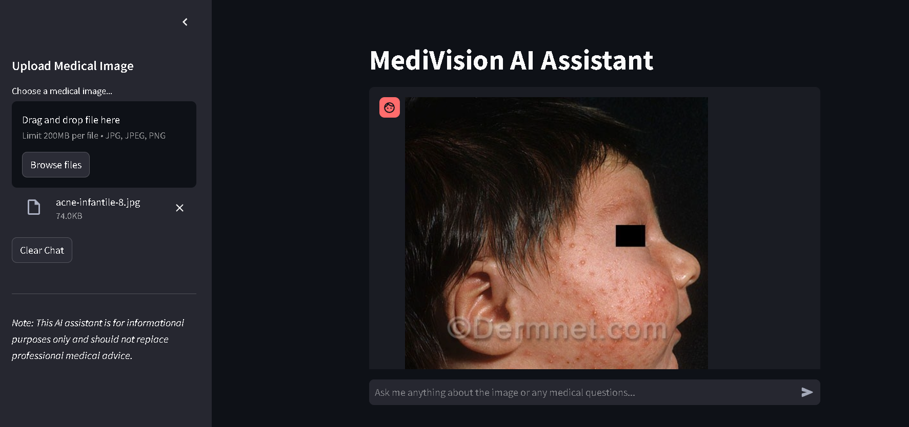

<h1>MediVision AI Assistant </h1>
MediVision is an AI-powered medical assistant allows users to upload medical images (e.g., X-rays, MRI scans) and get detailed analysis, including possible diagnoses, anatomical structures, abnormalities, image quality assessment, and recommendations. It also includes a chatbot functionality to answer general medical queries.

<h2> setup </h2>
</pre>
                </li>
                <li><strong>Set up a virtual environment (optional but recommended):</strong>
                    <pre>python -m venv venv</pre>
                </li>
                <li><strong>Activate the virtual environment:</strong>
                    <ul>
                        <li><strong>Windows (PowerShell):</strong> <pre>.\venv\Scripts\Activate</pre></li>
                        <li><strong>macOS/Linux:</strong> <pre>source venv/bin/activate</pre></li>
                    </ul>
                </li>
                <li><strong>Install required dependencies:</strong>
                    <pre>pip install -r requirements.txt</pre>
                </li>
                <li><strong>Obtain Google Gemini API Key:</strong>
                    <ul>
                        <li>Go to the <a href="https://ai.google.dev/gemini-api/docs/api-key)" target="_blank">Google Cloud Console</a>.</li>
                        <li>Set up a new project and enable the <strong>Google Gemini API</strong>.</li>
                        <li>Obtain the API key and save it in a file named <code>api_key.py</code> in the project directory.</li>
                    </ul>
                    <pre># api_key.py
api_key = "your_api_key_here"</pre>
                </li>
                <li><strong>Run the application:</strong>
                    <pre>streamlit run app.py</pre>
                </li>
            </ol>
        

        
👨‍💻 Author- Shibam
        

